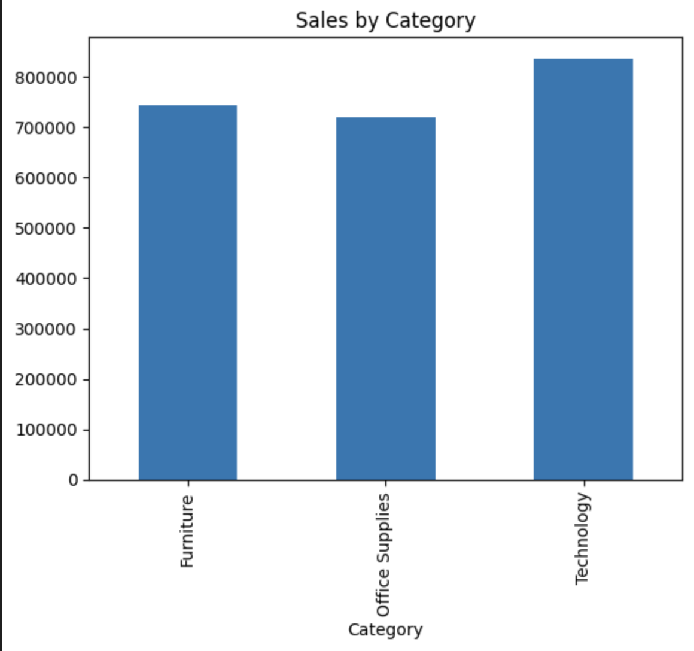
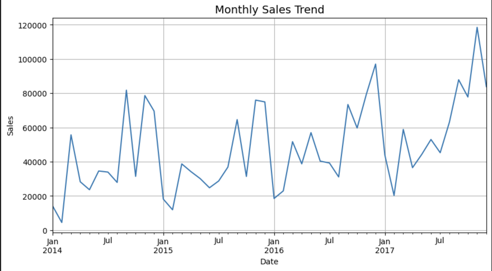
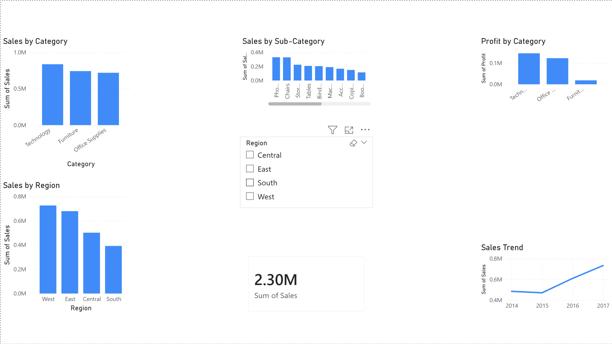
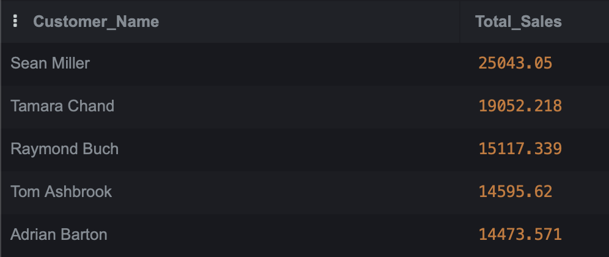
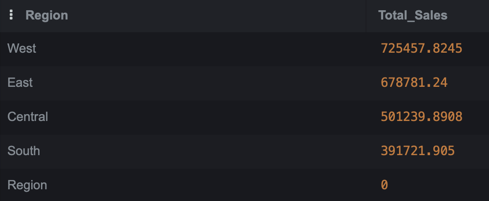
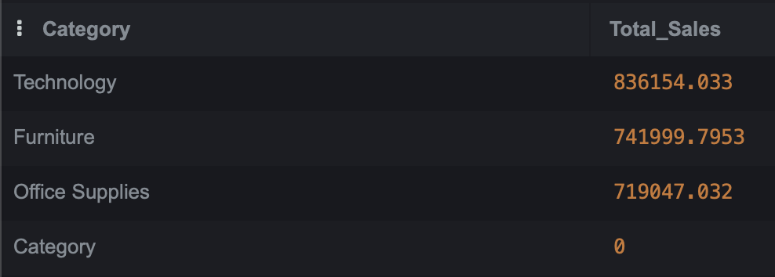

#  Data Analytics Projects

This repository contains my data analytics projects using Python, Power BI, and Machine Learning.

---

##  Projects Included

### 1️ Customer Behavior Analysis
📂 [View Project](./Customer_Behavior_Analysis_using_Python.ipynb)
- Analyzed retail sales data using Python
- Identified top customers, regions, and product categories
- Visualized trends and generated business insights

**Result:** Identified Technology as top-performing category, contributing highest revenue.

Insight: Technology category generates highest sales, indicating strong demand in this segment.

### 2️ Sales Prediction Model
📂 [View Project](./Sales_Prediction_Model.ipynb)
- Built a machine learning model to predict sales
- Used regression techniques
- Evaluated model performance

**Result:** Developed a regression model to forecast sales trends and support decision-making.

### 3️ Retail Sales Dashboard (Power BI)
📂 [View Project](./Retail%20Sales%20Performance%20Dashboard.pbix)
- Created interactive dashboard
- Visualized KPIs, sales trends, and regional performance

**Result:** Built an interactive dashboard enabling quick insights into regional and category performance.

Insight: West and East regions contribute the highest revenue.

## 4️ Superstore Sales Analysis (SQL Project)

Overview
Analyzed retail sales dataset using SQL to extract key business insights including total sales, profit, customer performance, and category trends.

Tools Used
	•	SQL (SQLite)
	•	Visual Studio Code

Key Insights
	•	Technology is the top-performing category (~836K sales)
	•	Top customer generated over 25K in sales
	•	Regional performance varies significantly
	•	High-value customers drive major revenue

Project Files
	•	queries.sql → SQL queries
	•	total_sales.png → Total sales result
	•	total_profit.png → Total profit
	•	sales_by_region.png → Region analysis
	•	top_customers.png → Top 5 customers
	•	category_analysis.png → Category performance

  **Sample Output**

  Below are sample outputs generated using SQL queries:

##  Dataset
- Superstore dataset used for analysis

---

##  Skills Used
- Python (Pandas, Matplotlib)
- Data Analysis
- Machine Learning
- Power BI
- Data Visualization

---

##  Author
- Mohammed Shadid
