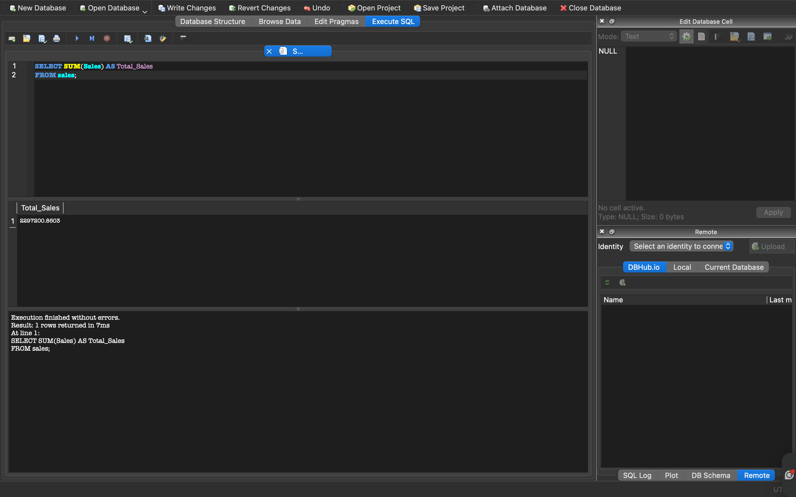
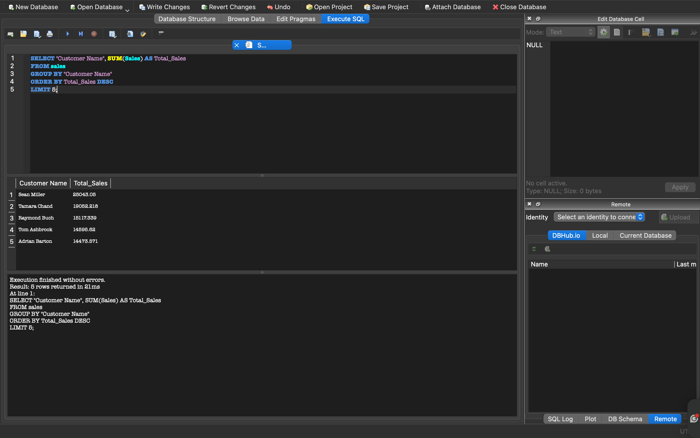
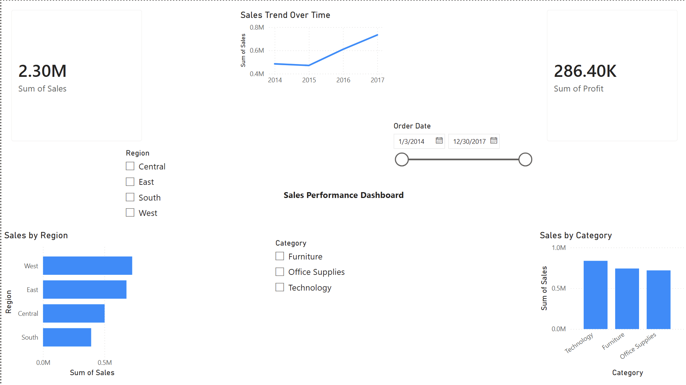

# Data Analytics Portfolio
### End-to-End Projects in Python, SQL, Machine Learning & Power BI

This repository showcases end-to-end data analytics projects including data analysis, visualization, machine learning, SQL, and dashboarding using real-world datasets. 
Focused on solving real-world business problems using data-driven insights and analytics.

---

##  Projects Included

### 1. Customer Behavior Analysis
📂 [View Code](./Customer_Behavior_Analysis_using_Python.ipynb)
- Analyzed retail sales data using Python
- Identified top customers, regions, and product categories
- Visualized trends and generated business insights

**Result:** Identified Technology as top-performing category, contributing highest revenue.

**Insight**: Technology category generates highest sales, indicating strong demand in this segment.

### 2. Sales Prediction Model
📂 [View Code](./Sales_Prediction_Model.ipynb)
- Built a machine learning model to predict sales
- Used regression techniques
- Evaluated model performance

**Result:** Developed a regression model to forecast sales trends and support decision-making.

### 3. Retail Sales Dashboard (Power BI)
📂 [View Code](./Retail%20Sales%20Performance%20Dashboard.pbix)
- Created interactive dashboard
- Visualized KPIs, sales trends, and regional performance

**Result:** Built an interactive dashboard enabling quick insights into regional and category performance.

**Insight**: West and East regions contribute the highest revenue.

## 4. Superstore Sales Analysis (SQL Project)

### Overview
Analyzed retail sales dataset using SQL to extract key business insights including total sales, profit, customer performance, and category trends.

### Tools Used
- SQL (SQLite)
- Visual Studio Code

### Key Insights
- Technology is the top-performing category (~836K sales)
- Top customer generated over 25K in sales
- Regional performance varies significantly
- High-value customers drive major revenue

### Project Files
- queries.sql → SQL queries
- sql_total_sales.png → Total sales result
- sql_total_profit.png → Total profit
- sql_sales_by_region.png → Region analysis
- sql_top_customers.png → Top 5 customers
- sql_category_analysis.png → Category performance

### Sample Output

## 5. Sales Performance Dashboard (Power BI)

### Overview  
Built an interactive Power BI dashboard to analyze sales performance across regions, categories, and time.

### Tools Used  
- Power BI  
- Excel (Superstore dataset)

### Key Features  
- KPI cards for Total Sales and Total Profit  
- Sales trend over time  
- Regional performance analysis  
- Category-wise breakdown  
- Interactive filters (Region, Category, Date)

### Key Insights  
- Technology is the top-performing category  
- West and East regions generate highest revenue  
- Sales show consistent growth over time  
- High-value segments drive major revenue  

### Business Impact
- Helps management identify top-performing regions and categories  
- Supports data-driven decision-making  
- Enables quick KPI monitoring  
- Improves strategic planning using trends

**Result:** Built an interactive dashboard for real-time business insights and KPI tracking.

### Dashboard Preview  

##  Dataset
- Superstore dataset used for analysis

---

##  Skills Used
- Python (Pandas, Matplotlib)
- SQL
- Data Analysis
- Machine Learning
- Power BI
- Data Visualization

---

##  Author
- Mohammed Shadid
